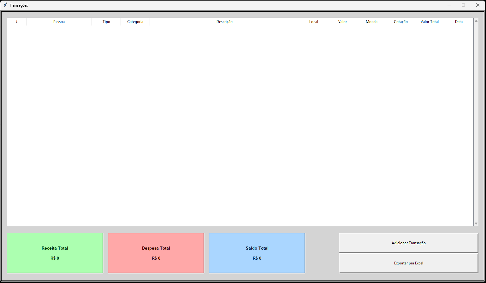
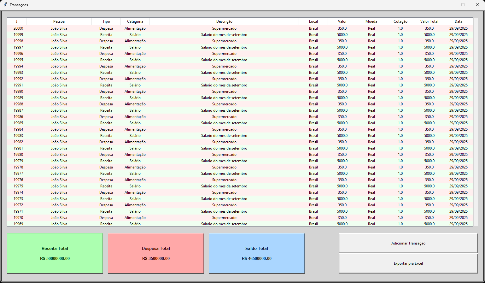
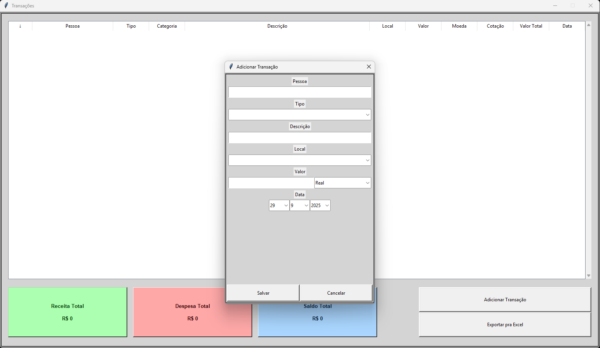
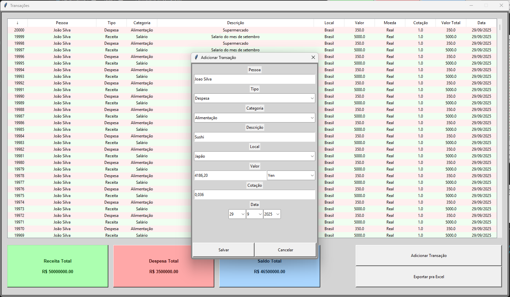
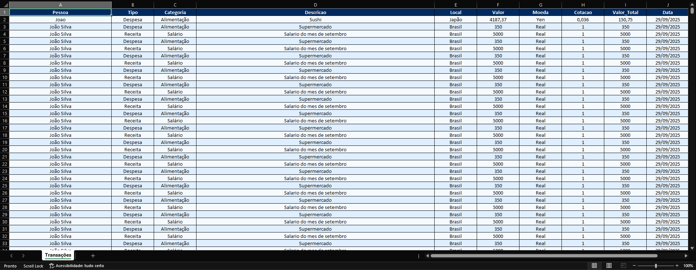

## Controle Financeiro

Um aplicativo desktop em Python para controle financeiro pessoal permitindo registrar transações de receitas e despesas, acompanhar saldos e exportar os dados para Excel.

Funcionalidades Principais:

- Adicionar, editar e excluir transações financeiras (Receitas e Despesas).

- Filtrar transações por tipo (Receita ou Despesa).

- Visualização de saldos: Receita total, Despesa total e Saldo total.

- Exportação das transações para Excel com formatação de cores, bordas e ajuste automático de colunas.

- Interface gráfica intuitiva com Tkinter, incluindo menus, botões e validação de entradas.

- Suporte a múltiplas moedas com cotação automática (Real, Dólar, Won, Yen).

- Persistência de dados utilizando SQLite com SQLAlchemy.

## Tecnologias Utilizadas

- Python 3.x

- Tkinter – interface gráfica.

- SQLAlchemy – ORM para banco de dados SQLite.

- OpenPyXL – exportação de dados para Excel.

- SQLite – banco de dados local.

- Regex – validação de campos de entrada.

## Destaques Técnicos

- Validação de entrada para garantir integridade dos dados (nomes, valores monetários, datas, etc).

- Sistema de filtragem e ordenação dinâmico no Treeview.

- Estrutura modular separando interface (Tkinter) e lógica de dados (SQLAlchemy).

- Uso de CheckConstraints no SQLite para garantir consistência de tipos, categorias, moedas e valores.

- Geração de planilhas Excel com cores alternadas para linhas e cabeçalhos estilizados.

## Telas
#### Principal (Sem transações)

#### Principal (Com Transações)

#### Formulario (Incompleto)

#### Formulario (Completo)

#### Exemplo do Excel Exportado
